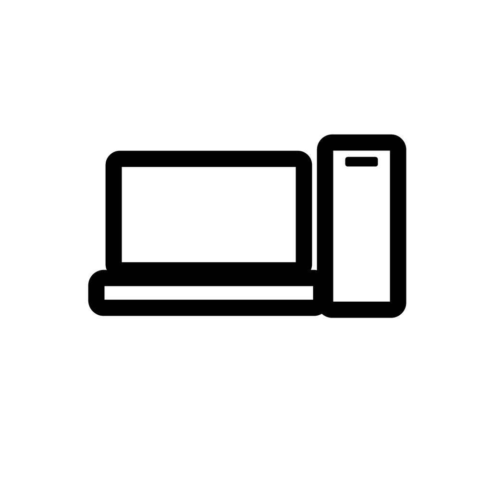
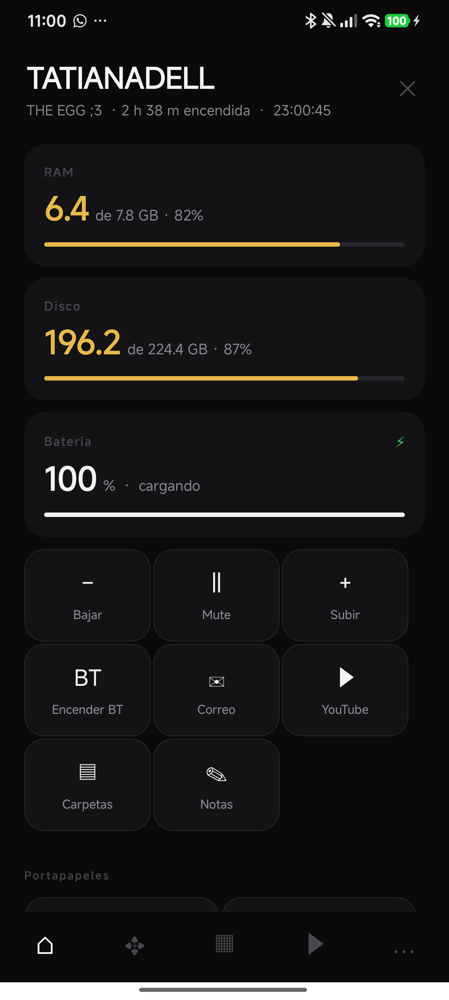
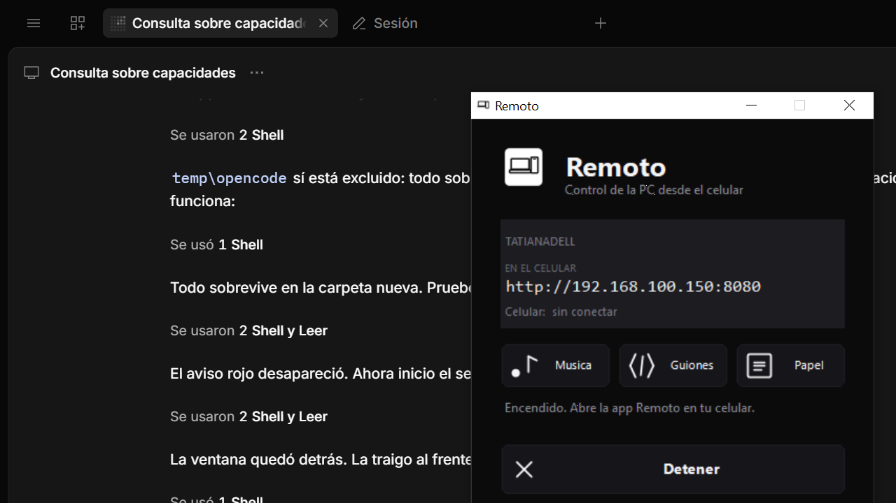
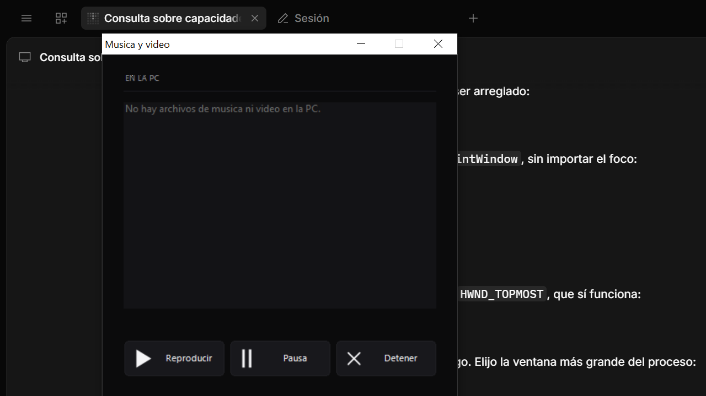
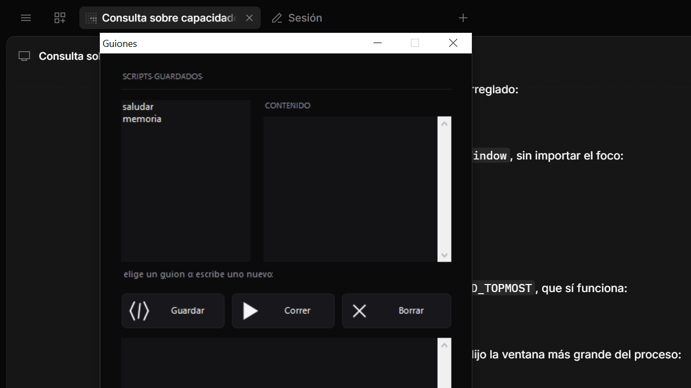
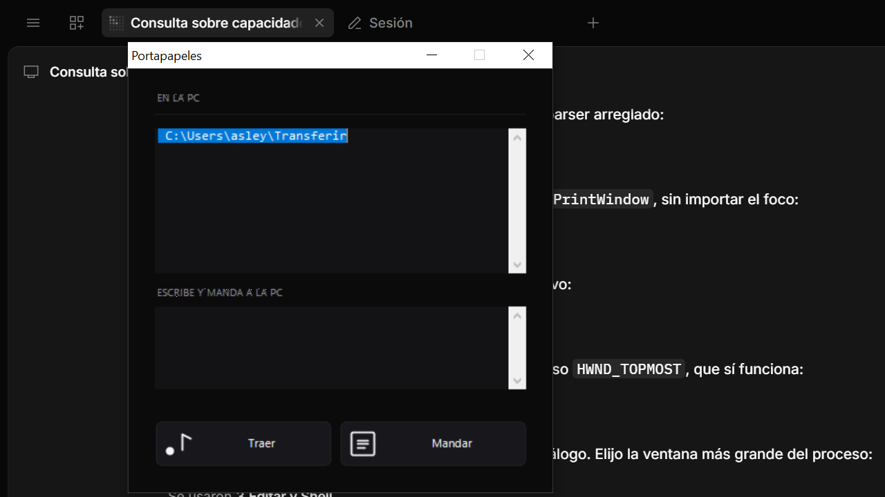

<p align="center">
  
</p>

<h1 align="center">Remoto</h1>

<p align="center">
  <b>Tu computadora, desde el celular, por el WiFi de casa.</b><br>
  <sub>Sin internet. Sin cuentas. Sin cables. Sin instalar drivers.</sub>
</p>

<p align="center">
  <a href="https://github.com/wizard646/remoto/blob/main/LICENSE"></a>
  <a href="https://github.com/wizard646/remoto#privacidad"></a>
  
  
  
  
</p>

```
┌────────────────────────────┐        │  ┌──────────────────────────────────┐
│ MI-PC                │        │  │ Remoto                           │
│ 2 h 38 m · 23:00:45        │        │  │                                  │
│                            │        │  │ MI-PC                      │
│ RAM                        │        │  │                                  │
│ 6.4 de 7.8 GB · 82 %       │        │  │ Celular: Redmi Note 13 Pro       │
│ ████████████████░░░░       │        │  │           (192.168.1.77)      │
│ DISCO                      │     ─── · │                                  │
│ 196.2 de 224.4 GB · 87 %   │        │  │ Encendido                        │
│ ██████████████████░░       │        │  │                                  │
│ BATERIA                    │        │  │ +-----+ +-----+ +-----+          │
│ 100 % · cargando           │        │  │ |  >  | |  <  | |  #  |          │
└────────────────────────────┘        │  │ | Mus | | Gui | | Pap |          │
                                      │  │ +-----+ +-----+ +-----+          │
                                      │  └──────────────────────────────────┘
```

<p align="center">
  
</p>

---

## Las dos apps

<table>
<tr>
<td width="50%" align="center"><b>El celular</b><br><sub>React Native</sub></td>
<td width="50%" align="center"><b>La computadora</b><br><sub>PowerShell + C#</sub></td>
</tr>
<tr>
<td align="center"></td>
<td align="center"></td>
</tr>
</table>

La ventana de la PC tiene tres botones: **Musica**, **Guiones** y **Papel**.

<table>
<tr>
<td align="center"></td>
<td align="center"></td>
<td align="center"></td>
</tr>
<tr>
<td align="center" width="33%"><b>Musica y video</b><br><sub>suena sin abrir ventanas</sub></td>
<td align="center" width="33%"><b>Guiones</b><br><sub>scripts guardados con nombre</sub></td>
<td align="center" width="33%"><b>Portapapeles</b><br><sub>en las dos direcciones</sub></td>
</tr>
</table>

---

## Te suena esto?

- **Te acostaste y no te dan las ganas de levantar** para apagar la luz de la compu.
- **La PC esta en el escritorio y vos en el sillon**, y hay que mover el mouse.
- **Te quedaste un archivo abajo** y no queres destrabarte de la silla.
- **La bateria del celu se acaba** y el cargador esta en otra habitacion.
- **Queres ver la pantalla de la PC** desde la cama, sin encender el monitor.

Remoto resuelve las cinco. Abri la app, escribi la direccion de la PC, listo.

<p align="center">
  <b>Funciona igual de bien que el famoso, pero no te pide tarjeta de credito,</b><br>
  <b>no manda nada a un servidor en otro pais, y no graba lo que haces.</b>
</p>

---

## Todo lo que hace

**Escritorio**

| | |
|---|---|
| **Raton** | Mueve el cursor, clic derecho, rueda, y repite solo si mantienes presionado |
| **Teclado** | Teclas sueltas y combinaciones: `Ctrl+C`, `Ctrl+V`, `Ctrl+Alt+Supr`, `Alt+Tab`, `Win` |
| **Volumen** | Subir, bajar y silencio |
| **Bluetooth** | Lo enciende o lo apaga, y te dice en que estado esta |
| **Captura** | Manda la pantalla de la PC directo a tu celular |

**Archivos y trabajo**

| | |
|---|---|
| **Portapapeles** | Copia en la PC, pega en la PC, o trae un texto al celular |
| **Archivos** | Manda y baja archivos de hasta 500 MB |
| **Buscar** | Encuentra un archivo en el escritorio, documentos o descargas |
| **Consola** | Guarda scripts con nombre y los corre con un toque |

**Lo que mas se usa**

| | |
|---|---|
| **Musica** | Suena en la PC sin abrir ninguna ventana, desde el celular |
| **Energia** | Apagar, reiniciar, suspender, o poner un temporizador de 15 minutos |
| **Apps** | Abre lo que tengas instalado y cierralo |
| **Estado** | RAM, disco, bateria, temperatura, USB y quien esta conectado |

Todo con unidades de verdad (`6.4 de 7.8 GB`), con porcentaje, y con colores
que avisan: **blanco** cuando todo va bien, **ambar** entre 75 y 90 %, **rojo**
si se pasa.

---

## Se instala en dos pasos

```
   la computadora                          el celular
   ──────────────                          ─────────
   1.  cd servidor                        3.  abrir Remoto
       montar.cmd                         4.  escribir 192.168.1.50
   2.  anotar la direccion                        y la clave
       y la clave que sale
```

### 1. En la computadora

```powershell
cd servidor
montar.cmd
```

Eso renombra los archivos, **compila y firma** `Remoto.exe`, **abre el puerto
8080** en el firewall y te muestra la direccion y la clave:

```
  Remoto listo.
  En el celular: http://192.168.1.50:8080
  Clave: A7K2M9  (esta en clave.txt, se puede cambiar)
  Abre Remoto.exe
```

No hay que instalar nada: el servidor es PowerShell, que ya viene en Windows.

### 2. En el celular

```bash
cd app
npm install
npx expo start
```

O baja el APK ya compilado, lo instalas, y escribes la direccion y la clave.

**Listo.** Celular y PC en la misma red, y ya te podes sentar en el sillon.

> **El antivirus lo va a borrar.** Remoto manda teclas y clics a la computadora,
> y eso se parece justo a un virus. Antes de instalar, agrega la carpeta a las
> excepciones de Bitdefender o de Windows Defender. El paso a paso esta en
> [COMO-INSTALAR.md](servidor/COMO-INSTALAR.md).

---

## Por que no se traba

La mayoria de los programas como este se congelan porque pregunta todo desde
cero en cada pedido. Consultar la RAM, la placa de red y los dispositivos USB
por WMI en Windows cuesta entre **4 y 18 segundos**.

Remoto lo parte en dos: un vigilante consulta lo lento **una sola vez** al
arrancar, y despues cada 2 segundos solo lo que cambia rapido. El servidor
solo lee ese archivo.

```
  lo lento, una vez          lo rapido, cada 2 s
  ┌──────────────────┐       ┌──────────────────────┐
  │ placa de red     │ ──┐   │ RAM                  │
  │ USB              │   │   │ bateria              │
  │ CPU y temperatura│   └──►│ disco                │
  │ sistema operativo│       │ procesos             │
  └──────────────────┘       └──────────┬───────────┘
                                         │ cache.json
                                         ▼
                                   ┌──────────┐
                                   │ servidor │  responde en 20 ms
                                   └──────────┘
```

| Consulta en Windows | Cuanto tarda |
|---|---|
| `Get-PnpDevice` (Bluetooth) | 5 477 ms |
| `Get-NetRoute` (la IP) | 4 382 ms |
| `Get-NetAdapter` (la placa) | 4 100 ms |
| `Get-NetConnectionProfile` | 1 957 ms |
| `Win32_OperatingSystem` | 963 ms |

Si eso se hiciera en cada pedido, con la app consultando cada 3 segundos, la
computadora no responderia. Asi quedo:

| | |
|---|---|
| **Respuesta** | 20 milisegundos |
| **Consumo de CPU** | 1,6 % de un nucleo |
| **Memoria** | unos 120 MB |
| **Antes** | 22 segundos por pedido |

Tambien usa `SendInput`, la API de Windows que sigue viva hoy, para que las
flechas y las combinaciones como `Ctrl+C` lleguen de verdad. La vieja
`keybd_event` esta obsoleta y las descarta.

---

## Privacidad

```
  ✗  camara                      ✗  grabacion de pantalla
  ✗  microfono                   ✗  datos que salen de tu casa
  ✗  cuenta o registro            ✗  publicidad
  ✓  clave en cada pedido         ✓  solo tu red WiFi
  ✓  sin camara, sin micros       ✓  licencia MIT, leelo y cambialo
```

- **No sale de tu casa.** El servidor escucha en la red local y no abre puertos
  hacia internet por su cuenta.
- **Clave en cada pedido.** Sin ella, no responde.
- **Sin camara, sin microfono, sin grabacion de pantalla.** No esta, y no se
  puede agregar. Eso es lo que distingue a una herramienta de control de un
  spyware.
- **Sin cuentas, sin telemetria, sin publicidad.**

`app/miapp.keystore` y `servidor/clave.txt` no estan en el repositorio, y a
proposito.

---

## Las cinco funciones que no vas a ver en otro

### Portapapeles compartido

Traes el texto de la PC al celular y al reves. Se actualiza solo al abrir la
pantalla, asi que no hay que apretar nada.

### Reproductor de audio y video

Lista lo que hay en las carpetas de musica y video de la PC y lo controla desde
el celular. **No abre ninguna ventana**: usa el control de Windows Media por
detras, asi que la musica sigue sonando aunque cierres Remoto.

Revisa `Music`, `Música`, `Videos` y `Descargas`.

### Guiones

Guardas scripts de PowerShell con nombre y los corres desde el celular. La
salida te la muestra la misma app. Se guardan en `servidor/guiones.json`.

```powershell
$os = Get-CimInstance Win32_OperatingSystem
Write-Output ("Encendida hace " + [int]((Get-Date) - $os.LastBootUpTime).TotalHours + " h")
Get-Service | Where-Object { $_.Status -eq 'Stopped' } | Select-Object -First 10 Name
```

### Temporizador de energia

Dormir, apagar o reiniciar con cuenta regresiva. Corre en un proceso aparte
(`servidor/cuentaatras.ps1`), asi que **sigue funcionando aunque cierres Remoto
o se caiga el servidor**. Para cancelar se borra `cuentaatras.json`.

### Transferencia de archivos

La carpeta `Descargas\Desde-Celular`. En la app, **Mas > Archivos**: tocar un
archivo lo abre en la PC.

---

## Detalle de cada pantalla

**Inicio** — RAM, disco, bateria y temperatura con avisos por color. Volumen,
Bluetooth, accesos directos, portapapeles. Bloquear, capturar, reiniciar,
apagar.

**Raton** — panel para arrastrar el cursor, clics, rueda y teclado.

**Apps** — lista de programas instalados, con buscador. Permite cerrarlos.

**USB** — dispositivos conectados.

**Archivos** — carpeta de transferencia, con busqueda. Subir y descargar.

**Clave** — cambiar la clave de acceso.

Todo lo que se ejecuta queda anotado en `servidor/registro.txt`.

---

## Atajos y detalles de la interfaz

| Donde | Que hace |
|---|---|
| App, pantalla de entrada | Teclado en pantalla, solo numeros. Con **ABC** abris letras para la clave |
| App, barras de RAM/disco/bateria | Se llenan de verde mientras crecen, y despues toman el color del nivel |
| App, pestana de abajo | Iconos: inicio, raton, apps, media, mas |
| PC, ventana | Tres botones: Musica, Guiones y Papel |
| PC, bandeja | Clic derecho para abrir, iniciar, arrancar con Windows y salir |

---

## Saber que celular se conecto

El servidor guarda de que aparato es cada peticion. La app manda su nombre en
la cabecera `x-dispositivo`, y el PC lo muestra abajo en la ventana de Remoto:

```
Celular:  Redmi Note 13   (192.168.1.77)
```

Tambien queda anotado en `servidor/registro.txt` cada vez que entra uno nuevo,
y se puede consultar desde el navegador:

```
http://192.168.1.50:8080/api/clientes
```

Si el celular no manda su nombre (por ejemplo el navegador, o una version
vieja de la app), el servidor intenta deducirlo por la red: primero busca el
nombre del vecino en Windows, despues el DNS inverso.

La PC no se cuenta a si misma entre los celulares conectados.

---

## Como esta hecho

```
app/          la aplicacion del celular (React Native / Expo)
servidor/     el programa que corre en la PC (PowerShell + C#)
```

Windows 10 y 11 para la computadora, Android para el celular.

---

## Compilar la app de PC

`Remoto.exe` sale de `Remoto.cs` y `RemotoVentanas.cs`. Necesitas el
compilador de .NET que ya viene con Windows, no hay que instalar nada. En la
mayoria de los casos alcanza con correr `montar.cmd`.

```powershell
& "$env:SystemRoot\Microsoft.NET\Framework64\v4.0.30319\csc.exe" `
  /target:winexe /out:Remoto.exe /win32icon:Remoto.ico `
  /resource:Remoto.ico,Remoto.ico `
  /resource:logo-remoto.png,logo-remoto.png `
  /reference:System.dll /reference:System.Drawing.dll /reference:System.Windows.Forms.dll `
  Remoto.cs RemotoVentanas.cs
```

El logo va embebido dentro del `.exe`, asi que el programa es un solo archivo
y no se rompe si borras los imagenes de al lado.

### Cambiar el logo

El archivo `.txt` del logo esta en `servidor/fuentes/`. Cambialo y corre
`montar.cmd` de nuevo: el `.exe` toma el logo nuevo.

---

## Compilar la app del celular

Necesitas Node.js 18 o superior, y para el APK tambien Java 17 y el
Android SDK.

```powershell
cd app
npm install
npx expo prebuild --platform android
cd android
gradlew.bat assembleRelease --no-daemon
```

La APK queda en:
`app/android/app/build/outputs/apk/release/app-release.apk`

**Importante:** despues de `prebuild`, hay que volver a agregar la firma en
`app/android/gradle.properties` (no reemplazar el archivo, agregar estas lineas):

```
android.injected.signing.storeFile=RUTA/MI/app/miapp.keystore
android.injected.signing.storePassword=mipc1234
android.injected.signing.keyAlias=miapp
android.injected.signing.keyPassword=mipc1234
```

---

## Cambiar el servidor

Edita el archivo `servidor/servidor.ps1.txt` y corre `montar.cmd`.

Sirve en el puerto 8080. Cambia `$PUERTO` si choca con otra cosa.

La clave se guarda en `servidor/clave.txt`. Si lo borras, se genera una nueva
al arrancar. Se puede cambiar desde la app o escribiendo a mano ese archivo.

Las rutas de API estan todas juntas mas abajo en `servidor.ps1`, una por
bloque dentro del `switch`.

---

## Seguridad

- La clave viaja en texto plano por la red. Al estar en tu WiFi es aceptable,
  pero no lo abras desde internet.
- El firewall de Windows bloquea el puerto 8080. `montar.cmd` lo abre una vez.
- Si tu router tiene "aislamiento de clientes" activado, no va a funcionar.
  Hay que desactivarlo en los ajustes del router.

---

## Limitaciones conocidas

**El teclado necesita foco.** Windows manda las teclas a la ventana que esta
en primer plano. Antes de escribir desde el celular, hay que hacer clic en la
ventana de la PC donde quieras escribir.

**La tecla de Windows no siempre llega.** Windows la bloquea por seguridad como
proteccion contra keyloggers. El boton existe, pero depende de la version.

**Solo red local.** No funciona desde datos moviles ni desde fuera de casa.

**Archivos hasta 500 MB.** Para archivos grandes conviene cable USB.

---

## Publicar en GitHub

**1. Crea el repositorio vacio en la pagina**

Entra en https://github.com/new y ponle:

| Campo | Valor |
|---|---|
| Owner | `wizard646` |
| Nombre del repositorio | `remoto` |
| Visibilidad | Publica o Privada, a tu gusto |
| README | **no** marques nada |

**2. Sube los archivos**

```powershell
cd $env:USERPROFILE\Remoto-Proyecto
git push -u origin main
```

La primera vez Windows te abre una ventana del navegador para que inicies
sesion en GitHub. Aceptas y listo.

**Que NO se sube** (esta en `.gitignore` a proposito)

| Archivo | Por que |
|---|---|
| `app/miapp.keystore` | Es la llave de firma. Con ella cualquiera publica una version con tu nombre. |
| `servidor/clave.txt` | La clave con la que se entra a tu computadora. |
| `servidor/*.ps1`, `*.exe`, `*.ico` | Se generan al instalar. En el repositorio van como `.ps1.txt`. |
| `servidor/registro.txt`, `cache.json` | Son datos de tu equipo, no del programa. |

**Subir un cambio mas adelante**

```powershell
cd $env:USERPROFILE\Remoto-Proyecto
git add .
git commit -m "que cambiaste"
git push
```

---

## Licencia

MIT. Ver `LICENSE`.